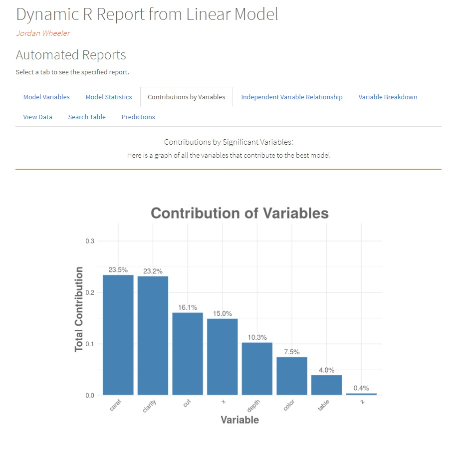
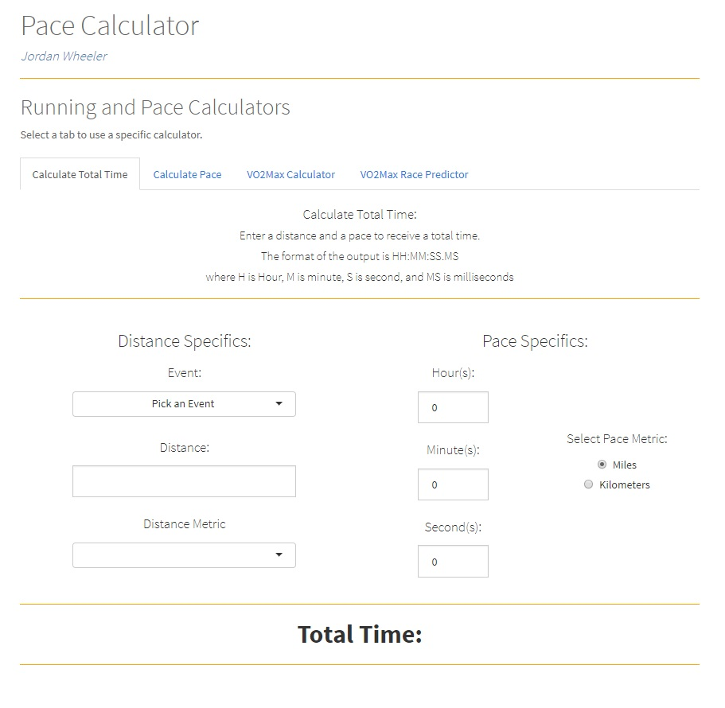

<meta name="author" content="Jordan Wheeler">
<meta name="description" content="Jordan Wheeler's Shiny Applications">

 

<h6 style="float: left; font-size: 12pt; text-align: center; width: 45%; margin-right: 5%; margin-bottom: 0.5em;">Linear Model Report:  </h6>

<h6 style="float: left; font-size: 12pt; text-align: center; width: 45%; margin-left: 5%; margin-bottom: 0.5em;">Running and Pace Calculator:  </h6>

<h6 style="clear: both;">
